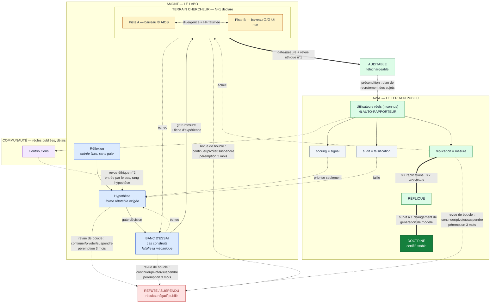

# ONDE AI R&D · PIPELINE DE RECHERCHE v2.1

*Vue publique : instantané du 2026-08-02, non resynchronisé depuis : la cassette interne du
laboratoire fait foi, et elle a avancé (registre en révision 16 au 2026-08-11). Resynchronisation
complète : gate déclarée avant toute mise en public ([CHANGELOG](../CHANGELOG.md), 0.3.0).*

*Version publiée du pipeline en vigueur au laboratoire (validé en juillet 2026). Péremption N = 3 mois : valeur unique, partagée avec le [protocole des projets](PROTOCOLE-PROJETS.md). Restent ouverts, par règle (voir [PROTOCOLE-CQM.md](PROTOCOLE-CQM.md)) : les valeurs X et Y de la réplication : elles se fixent avant la première mesure concernée, jamais avant d'avoir un terrain.*

---

## 1. Le principe directeur

Un seul chercheur, des moyens bornés, une exigence : **le process doit coûter moins cher que la recherche qu'il encadre.** Toute gate dont l'administration prend plus de temps que l'expérience qu'elle garde est mal conçue et doit être simplifiée. Le pipeline incarne la thèse du labo (l'IA propose, l'humain décide) et s'applique à lui-même : il est passé par sa propre gate.

## 2. Le pipeline en une vue

```
AMONT (labo)                                      AVAL (terrain public)
réflexion → hypothèse → BANC D'ESSAI → TERRAIN CHERCHEUR → AUDITABLE → utilisateurs réels → RÉPLIQUÉ → DOCTRINE
                              ↑______________boucles définies + revue à chaque boucle______________|
                                        péremption : 3 mois sans activité → suspendu
```

Sept étages au lieu de huit : **test labo et émulation fusionnent en « banc d'essai »** : la revue n'a pas su nommer deux dispositifs expérimentaux distincts, donc c'était deux noms pour un même acte. Si un jour la distinction redevient nécessaire, elle devra se justifier par un appareillage différent, pas par un mot.

## 3. Les étages : ce qui entre, ce qui se mesure, ce qui sort

**Réflexion.** Entrée libre : observations de terrain, lectures, intuitions. Aucune gate : c'est le seul étage sans contrôle, et il doit le rester.

**Hypothèse.** Une réflexion devient hypothèse quand elle est écrite sous forme réfutable : *« si [mécanisme], alors [effet observable], mesuré par [indicateur] »*. Gate-décision (GO consigné en une ligne). C'est ici qu'entrent aussi les contributions communautaires, jamais plus haut.

**Banc d'essai.** L'hypothèse est éprouvée sur des cas construits par le labo : projets synthétiques, protocoles rejoués, conditions contrôlées. Le banc **falsifie la mécanique, ne valide jamais la valeur**. Gate-mesure : fiche d'expérience obligatoire.

**Terrain chercheur.** Le mécanisme est utilisé en conditions réelles de production par le praticien-chercheur (N=1 déclaré) sur **deux pistes** : piste A, barreau ③ (système AIOS (accès à un AIOS de production acquis, voir § 7 bis) ; piste B, barreau ①/② (UI nue) GPT, Claude…). Les deux pistes doivent passer ; **ordre libre, fenêtre bornée** (le parallélisme strict doublait la charge sans acheter de comparabilité, déjà limitée par l'usage de projets distincts). Une divergence A/B n'est pas une panne : c'est **H4 (transversalité) falsifiée** : un résultat, qui se publie. Gate-mesure + **revue éthique n° 1** avant passage (première exposition de tiers en aval).

**Auditable.** Le mécanisme est publié : téléchargeable, protocole complet, critères de réplication inclus. À ce stade le labo affirme seulement : *« ceci a tenu chez nous, voici comment nous contredire »*. Gate-décision.

**Utilisateurs réels.** Des inconnus utilisent le kit. Leurs retours arrivent par trois canaux **qui n'ont pas le même pouvoir** :
- *scoring* (notes, étoiles) = **signal** : priorise le travail du labo, ne fait jamais franchir une gate ;
- *rapport de réplication* = **mesure** : la seule chose qui fait monter ;
- *audit tiers* = **falsification** : une faille démontrée renvoie le mécanisme à l'étage hypothèse.

**Répliqué.** ≥ X réplications indépendantes sur ≥ Y workflows distincts (valeurs fixées au protocole CQM avant première mesure). L'exigence de workflows distincts protège du sur-ajustement à un cas d'usage unique.

**Doctrine : certifié stable.** Répliqué **+ a survécu à au moins un changement de génération de modèle sans révision du mécanisme**. C'est la définition opérationnelle de « stable » pour un labo de méthodes IA : ce qui ne dépend pas d'un modèle particulier. Gate-décision finale.

## 4. Les deux espèces de gates

| Espèce | Coût | Forme | Où |
|---|---|---|---|
| **Gate-décision** | une ligne au log | GO/NO-GO daté, signé, motivé en une phrase | hypothèse, auditable, doctrine |
| **Gate-mesure** | une fiche d'expérience | protocole + indicateurs + résultat | banc d'essai, terrain chercheur, répliqué |

Trois gates instrumentées seulement. Tout le reste est jugement humain consigné : rapide, traçable, suffisant.

## 5. Les boucles · échec, revue, péremption

- **Chaque gate définit où renvoie l'échec** : banc d'essai échoué → hypothèse · terrain chercheur échoué → banc d'essai (ou hypothèse si le mécanisme casse) · réplication échouée → terrain chercheur · faille d'audit → hypothèse.
- **Revue de boucle obligatoire** : à chaque retour, une décision explicite est consignée (*continuer / pivoter / suspendre*) avec sa raison. C'est le jugement du chercheur qui décide, pas un compteur : un seuil arithmétique (K boucles) serait de la fausse précision : de l'arbitraire déguisé en rigueur.
- **Péremption** : toute hypothèse sans activité depuis **3 mois** passe automatiquement `suspendue`. Le temps est observable ; il ne se discute pas.
- **Sortie vers la mort** : `réfuté` (falsifié par mesure ou audit) ou `suspendu` (jugement ou péremption). Dans les deux cas, **le résultat négatif se publie** comme les positifs. Sans sortie vers la mort, rien n'est réfutable : tout serait éternellement « pas encore passé ».

## 6. Les instruments du labo

1. **Le cahier d'expériences** : une fiche par run : date, hypothèse, version du protocole, piste/barreau, résultat, nombre d'itérations correctives, décision. C'est ici que vit la métrique du labo (*itérations correctives par livrable validé*) ; sans lui, elle n'existe pas. Artefact le moins cher, valeur la plus haute.
2. **Le registre des hypothèses** : la vue des rangs ([REGISTRE-HYPOTHESES.md](REGISTRE-HYPOTHESES.md)). Mis à jour à chaque franchissement, en même temps que la fiche : les deux, sinon dérive D4.
3. **Le kit auto-rapporteur** : application de l'axiome de la double valeur à l'instrument de mesure lui-même : le kit de réplication **produit le rapport comme sous-produit du travail** de l'utilisateur. Si le rapport est un devoir à rendre, il n'arrivera jamais ; s'il se génère pendant l'usage, chaque utilisateur est un point de mesure. Exigence de conception du démonstrateur, pas une option.

## 7. La précondition de l'aval · le recrutement des sujets

Entre « auditable » et « utilisateurs réels », il y a une flèche sur le schéma et un gouffre dans la réalité : personne ne réplique un protocole que personne ne trouve. **Avant l'ouverture de l'aval, le labo écrit son plan de recrutement** : d'où viennent les dix premiers inconnus, par quel canal, avec quel message. Sans ce plan, un X=0 serait illisible : échec de la méthode ou absence d'échantillon ? Un labo qui ne peut pas distinguer les deux ne mesure rien.

## 7 bis. L'accès à un AIOS de production · ce qu'il permet, ce qu'il ne prouve pas

Le labo dispose d'un **accès à un AIOS de production** pour monter des batteries de test. C'est un atout d'infrastructure à trois usages :

1. **Banc d'essai en environnement AIOS réel** : les cas construits peuvent tourner sur un OS de production, pas seulement en conditions simulées ;
2. **Piste A du terrain chercheur** : cet AIOS est l'environnement naturel du barreau ③ ;
3. **Canal de recrutement pour l'aval** : ses utilisateurs sont des répliquants potentiels (à inscrire au plan de recrutement du § 7, canal déclaré).

Trois gardes, non négociables : **cet AIOS est un OS *parmi d'autres* au barreau ③** : un mécanisme validé uniquement sur lui n'a pas démontré H4, et la piste B (UI nue) reste obligatoire ; **jamais un argument de validité** : « ça tourne sur cet AIOS » est une condition d'expérience, pas une preuve ; **le lien est déclaré** : toute publication qui mobilise des tests ou des utilisateurs de ce canal déclare le lien, et les répliquants venus de ce canal sont étiquetés comme tels dans les mesures (leur indépendance est moindre que celle d'un inconnu total : on les compte, mais on les distingue).

## 8. L'éthique : partout, légère ; deux points durs

- **Checklist E-5**, évaluée à chaque gate, cinq lignes fixes : données personnelles/RGPD · consentement des personnes impliquées · divulgation des liens et conflits d'intérêts · potentiel de détournement · charge et risque pour l'utilisateur. Cinq cases, pas une bureaucratie.
- **Revue formelle n° 1** à l'entrée d'auditable (première exposition de tiers).
- **Revue formelle n° 2** à l'ouverture communautaire (règles, consentement et droits des contributeurs posés avant).
- Gouvernance : le fondateur tient les revues au départ ; un regard extérieur ponctuel (même non expert) est recherché : une revue éthique tenue uniquement par celui qui a intérêt au passage a la structure d'une auto-certification.

## 9. La communauté

Deux canaux, jamais confondus : les **retours** (scoring/réplication/audit — § 3) et les **contributions** (profils, mods, améliorations). Les contributions entrent **par le bas**, au rang hypothèse, et repassent toutes les gates : mêmes CQM, symétrie totale. Modération : autorité humaine, **critères publiés, délais tenus** : la légitimité vient des règles et des délais ; « bienveillante » est un ton d'exercice, pas un critère. Si les délais ne sont pas tenus, la communauté forke, et elle aura raison.

## 10. Le diagramme



---

*Règle d'hygiène permanente : si administrer une gate coûte plus que l'expérience qu'elle garde, c'est la gate qu'on répare.*
